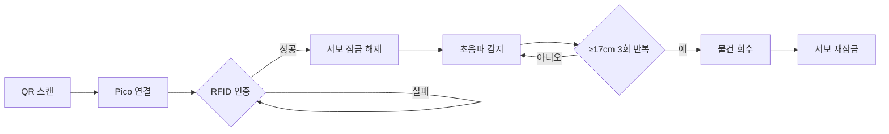

|     부품     |   주요 역할  | 상세 기능 (프로젝트 로직 기준)                                  |
| :--------: | :------: | :-------------------------------------------------- |
| RFID-RC522 |  사용자 인증  | RFID 태그를 읽어 배달 물품 수령 자격을 확인합니다.                     |
| Piezo (부저) |  오디오 피드백 | 인증 성공 또는 실패 시 서로 다른 소리를 발생시켜 사용자에게 상태를 알립니다.        |
|   RGB-LED  |  시각 피드백  | 인증 성공 시 초록색, 실패 시 빨간색으로 점등하여 사용자에게 상태를 시각적으로 보여줍니다. |
|    서보모터    | 잠금 장치 제어 | RFID 인증 성공 시 트레이 잠금을 풀고, 물품 픽업 감지 완료 시 다시 잠급니다.     |

|                연결 위치                |      구성 요소      | 설명                           |
| :---------------------------------: | :-------------: | :--------------------------- |
| **Raspberry Pi Pico (MicroPython)** |    RFID-RC522   | 인증 입력 장치                     |
|                                     | Piezo / RGB-LED | 인증 성공/실패에 대한 피드백 출력          |
|      **Raspberry Pi 4 (ROS 2)**     |       서보모터      | 인증 및 픽업 감지 결과에 따른 잠금장치 물리 제어 |
|                                     |      초음파 센서     | 물품 픽업 상태 감지 (주요 미션 센서)       |

