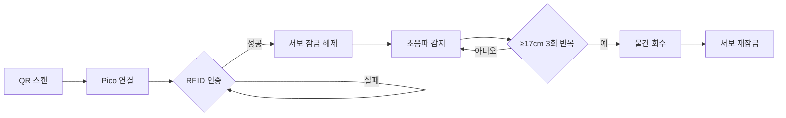

|     부품     |   주요 역할  | 상세 기능 (프로젝트 로직 기준)                                  |
| :--------: | :------: | :-------------------------------------------------- |
| RFID-RC522 |  사용자 인증  | RFID 태그를 읽어 배달 물품 수령 자격을 확인합니다.                     |
| Piezo (부저) |  오디오 피드백 | 인증 성공 또는 실패 시 서로 다른 소리를 발생시켜 사용자에게 상태를 알립니다.        |
|   RGB-LED  |  시각 피드백  | 인증 성공 시 초록색, 실패 시 빨간색으로 점등하여 사용자에게 상태를 시각적으로 보여줍니다. |
|    서보모터    | 잠금 장치 제어 | RFID 인증 성공 시 트레이 잠금을 풀고, 물품 픽업 감지 완료 시 다시 잠급니다.     |

|                연결 위치                |      구성 요소      | 설명                           |
| :---------------------------------: | :-------------: | :--------------------------- |
| **Raspberry Pi Pico (MicroPython)** |    RFID-RC522   | 인증 입력 장치                     |
|                                     | Piezo / RGB-LED | 인증 성공/실패에 대한 피드백 출력          |
|      **Raspberry Pi 4 (ROS 2)**     |       서보모터      | 인증 및 픽업 감지 결과에 따른 잠금장치 물리 제어 |
|                                     |      초음파 센서     | 물품 픽업 상태 감지 (주요 미션 센서)       |

|             이유            | 설명                                                                |
| :-----------------------: | :---------------------------------------------------------------- |
| **1. 여러 센서·모듈을 안정적으로 통합** | RFID, 초음파, 서보모터, 카메라, LiDAR 등 다양한 장치를 **노드 단위로 분리**하여 관리 가능       |
|    **2. 토픽 기반 메시지 전달**    | “RFID 인증 → 초음파 감지 → 서보 제어” 같은 **논리 흐름을 모듈 간 메시지로 클린하게 연결**        |
|      **3. 장애에 강한 구조**     | 한 장치가 오류 나도 전체 시스템이 죽지 않음 → **프로젝트에서 중요**                   |
|      **4. 재사용성과 확장성**     | 나중에 **새 센서 추가**, 로직 변경, 또는 실제 로봇으로 확장할 때 코드를 거의 그대로 재사용 가능        |
|   **5. Nav2와 자연스러운 연동**   | Scout Mini의 **자율주행(Nav2)과 바로 연결**되어, 배달 미션 전체가 하나의 ROS 생태계에서 처리됨  |
|     **6. 디버깅/관찰이 쉬움**     | RViz2, rqt, TF 등 시각화 도구로 **센서 상태·로직 흐름을 즉시 확인 가능**                |
|      **7. 분산 처리 가능**      | Raspberry Pi 4 + 개발자 PC(로컬 PC) 같이 **컴퓨터 여러 대를 동시에 쓰는 구조**가 쉽게 구성됨 |

