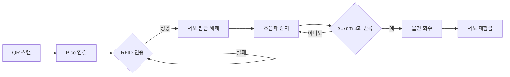

## 하드웨어 구성
|       부품      |   주요 역할   | 상세 기능 (프로젝트 로직 기준)                                  |
| :-----------: | :-------: | :-------------------------------------------------- |
|   RFID-RC522  |   사용자 인증  | RFID 태그를 읽어 배달 물품 수령 자격을 확인합니다.                     |
|   Piezo (부저)  |  오디오 피드백  | 인증 성공 또는 실패 시 서로 다른 소리를 발생시켜 사용자에게 상태를 알립니다.        |
|    RGB-LED    |   시각 피드백  | 인증 성공 시 초록색, 실패 시 빨간색으로 점등하여 사용자에게 상태를 시각적으로 보여줍니다. |
|      서보모터     |  잠금 장치 제어 | RFID 인증 성공 시 트레이 잠금을 풀고, 물품 픽업 감지 완료 시 다시 잠급니다.     |
| Bluetooth 스피커 | 음성/오디오 안내 | 인증 성공, 물품 회수 안내, 경고 등 **음성 기반 안내 메시지 출력**을 제공합니다.   |

|                연결 위치                |      구성 요소      | 설명                           |
| :---------------------------------: | :-------------: | :--------------------------- |
| **Raspberry Pi Pico (MicroPython)** |    RFID-RC522   | 인증 입력 장치                     |
|                                     | Piezo / RGB-LED | 인증 성공/실패에 대한 피드백 출력          |
|      **Raspberry Pi 4 (ROS 2)**     |       서보모터      | 인증 및 픽업 감지 결과에 따른 잠금장치 물리 제어 |
|                                     |      초음파 센서     | 물품 픽업 상태 감지 (주요 미션 센서)       |

## ros2 특징
### ROS2는 다양한 센서·액추에이터가 동시에 동작하는 복잡한 구조의 로봇 시스템을 안정적으로 구성하기 위한 사실상 표준 프레임워크
|             이유            | 설명                                                                |
| :-----------------------: | :---------------------------------------------------------------- |
| **1. 여러 센서·모듈을 안정적으로 통합** | RFID, 초음파, 서보모터, 카메라, LiDAR 등 다양한 장치를 **노드 단위로 분리**하여 관리 가능       |
|    **2. 토픽 기반 메시지 전달**    | “RFID 인증 → 초음파 감지 → 서보 제어” 같은 **논리 흐름을 모듈 간 메시지로 클린하게 연결**        |
|      **3. 장애에 강한 구조**     | 한 장치가 오류 나도 전체 시스템이 죽지 않음 → **프로젝트에서 중요**                   |
|      **4. 재사용성과 확장성**     | 나중에 **새 센서 추가**, 로직 변경, 또는 실제 로봇으로 확장할 때 코드를 거의 그대로 재사용 가능        |
|   **5. Nav2와 자연스러운 연동**   | Scout Mini의 **자율주행(Nav2)과 바로 연결**되어, 배달 미션 전체가 하나의 ROS 생태계에서 처리됨  |
|     **6. 디버깅/관찰이 쉬움**     | RViz2, rqt, TF 등 시각화 도구로 **센서 상태·로직 흐름을 즉시 확인 가능**                |
|      **7. 분산 처리 가능**      | Raspberry Pi 4 + 개발자 PC(로컬 PC) 같이 **컴퓨터 여러 대를 동시에 쓰는 구조**가 쉽게 구성됨 |

## rfid 강점

|            포인트            | 설명                                                     |
| :-----------------------: | :----------------------------------------------------- |
|   **1. 무인 상황에서도 보안 유지**   | 객실 배달은 프라이버시·보안이 중요 → RFID로 **수령자 본인확인** 가능            |
| **2. 비접촉식 인증 (더 위생적·빠름)** | 카드만 가까이 대면 인증 → 로봇과 사람이 접촉할 필요 없음                      |
|   **3. 자동화와 완벽한 연동 가능**   | 인증 성공 → 부저/LED 피드백 → 초음파 활성화 → 서보 해제까지 **자동 흐름 구축** |
|      **4. 오작동 위험 감소**     | 비밀번호 입력 방식보다 오류/실수 적음                  |
|   **5. 비용 효율적이고 확장 가능**   | 센서 가격 저렴 + 다양한 태그, 카드 확장 가능 → 대규모 장소에도 적용 쉬움           |

## Scout Mini 특징 요약

| 구분 | 설명 |
|---|---|
| **ROS2 기반 제어** | 로봇 운영체제(ROS2) 환경에서 노드·토픽·액션 기반 제어 가능 |
| **다양한 센서 통합** | LiDAR, 카메라, RFID 등 여러 센서를 동시에 연결하여 인식·판단 가능 |
| **표준/메카넘 휠 교체 가능** | 바퀴 형태를 바꿔 일반 주행 또는 제자리 회전 등 다방향 이동 지원 |
| **CAN/RS232 통신 지원** | 산업 표준 통신 방식으로 외부 장치 및 보드와 안정적인 데이터 교환 |
| **24V 외부 전원 출력 지원** | 기본 출력 전압이 24V라 DC-DC 변환기로 5V로 낮춰 라즈베리파이·서보 등에 공급 |

## Scout Mini – CAN 통신 특징 정리

| 항목 | 설명 |
|---|---|
| **통신 구조** | 여러 장치를 하나의 CAN 버스에 연결하여 동시에 통신 가능 |
| **신뢰성** | 오류 검출(ECC) 포함, 노이즈에 강하여 산업·자동차 환경에 적합 |
| **전송 속도** | 최대 1Mbps급으로 센서·모터 데이터 전달에 충분한 속도 |
| **통신 거리** | 수십~수백 m까지 안정적으로 유지 가능 |
| **데이터 전송 형식** | ID 기반 프레임 전송으로 메시지 구조가 명확하고 표준화 |
| **사용 목적** | 모터 드라이버 제어, 배터리 상태 모니터링, 서보·센서 통합 등 |
| **ROS 운영 방식** | CAN → ROS 노드에서 메시지 변환 후 Topic/Action으로 활용 |

## CAN vs RS232 비교

| 항목 | CAN 통신 | RS232 통신 |
|---|---|---|
| **방식** | 멀티 노드(버스형) 통신 | 1:1 직렬 통신 |
| **연결 구조** | 여러 장치를 한 라인에 연결 가능 (예: ECU 여러 개) | 두 장치 간 직접 연결 |
| **전송 속도** | 최대 약 1Mbps (높은 속도) | 일반적으로 115.2kbps 이하 (느림) |
| **통신 안정성** | 노이즈 강함, 오류 검출 기능 내장, 차량/산업용에 최적 | 노이즈에 약함, 장거리/환경 변화에 취약 |
| **통신 거리** | 수십~수백 m (환경에 따라) | 일반적으로 15m 내외 |
| **사용 분야** | 자율주행 로봇, 자동차, 산업 장비, PLC 등 | PC와 모듈 간 단순 시리얼 통신 |
| **예시** | 로봇 모터 컨트롤러, 배터리 상태 모니터링 | GPS 모듈 → PC 시리얼 데이터 |

